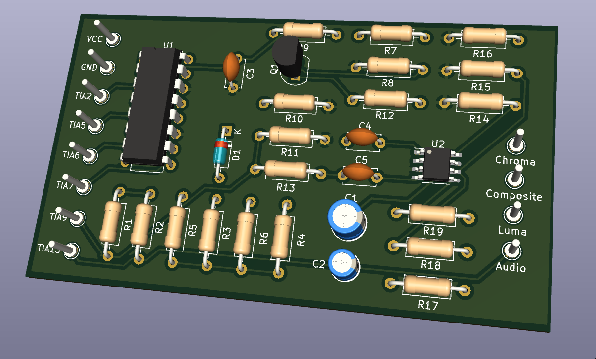
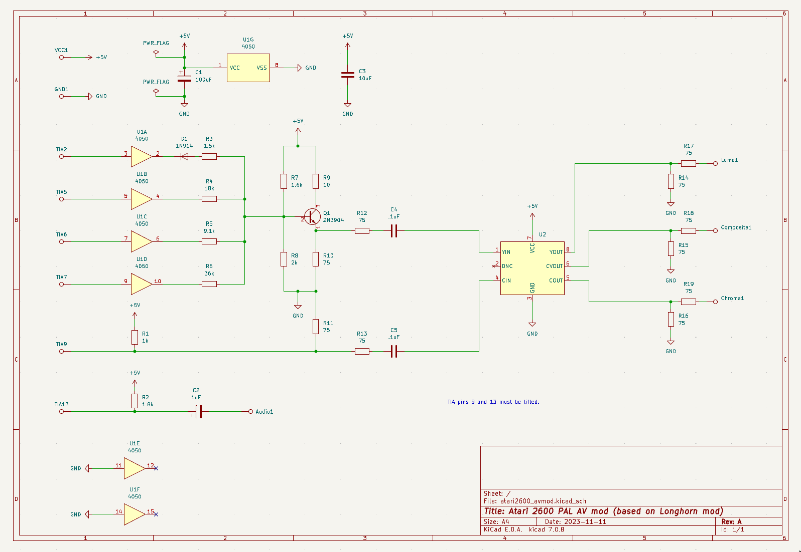
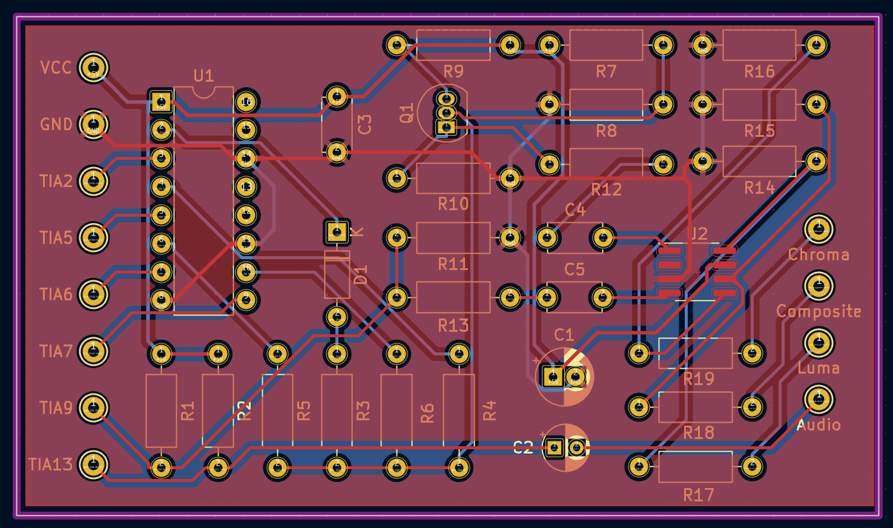

# Atari2600-AVmod
Atari 2600 AV mod based on Longhorn A/V mod

## Bill of material

|Qty|Ref|Value|LibPart|Footprint|
|---|---|-----|-------|---------|
|1|C1|100uF|Device:C_Polarized|Capacitor_THT:CP_Radial_D5.0mm_P2.00mm|
|1|C2|1uF|Device:C_Polarized|Capacitor_THT:CP_Radial_D4.0mm_P2.00mm|
|1|C3|10uF|Device:C|Capacitor_THT:C_Disc_D4.7mm_W2.5mm_P5.00mm|
|2|C4, C5|.1uF|Device:C|Capacitor_THT:C_Disc_D4.7mm_W2.5mm_P5.00mm|
|1|D1|1N914|Diode:1N914|Diode_THT:D_DO-35_SOD27_P7.62mm_Horizontal|
|1|Q1|2N3904|Transistor_BJT:2N3904|Package_TO_SOT_THT:TO-92_Inline|
|1|R1|1k|Device:R|Resistor_THT:R_Axial_DIN0207_L6.3mm_D2.5mm_P10.16mm_Horizontal|
|1|R2|1.8k|Device:R|Resistor_THT:R_Axial_DIN0207_L6.3mm_D2.5mm_P10.16mm_Horizontal|
|1|R3|1.5k|Device:R|Resistor_THT:R_Axial_DIN0207_L6.3mm_D2.5mm_P10.16mm_Horizontal|
|1|R4|18k|Device:R|Resistor_THT:R_Axial_DIN0207_L6.3mm_D2.5mm_P10.16mm_Horizontal|
|1|R5|9.1k|Device:R|Resistor_THT:R_Axial_DIN0207_L6.3mm_D2.5mm_P10.16mm_Horizontal|
|1|R6|36k|Device:R|Resistor_THT:R_Axial_DIN0207_L6.3mm_D2.5mm_P10.16mm_Horizontal|
|1|R7|1.6k|Device:R|Resistor_THT:R_Axial_DIN0207_L6.3mm_D2.5mm_P10.16mm_Horizontal|
|1|R8|2k|Device:R|Resistor_THT:R_Axial_DIN0207_L6.3mm_D2.5mm_P10.16mm_Horizontal|
|1|R9|10|Device:R|Resistor_THT:R_Axial_DIN0207_L6.3mm_D2.5mm_P10.16mm_Horizontal||
|10|R10, R11, R12, R13, R14, R15, R16, R17, R18, R19|75|Device:R|Resistor_THT:R_Axial_DIN0207_L6.3mm_D2.5mm_P10.16mm_Horizontal|
|1|U1|CD74HC4050|4xxx:4050|Package_DIP:DIP-16_W7.62mm|
|1|U2|FMS6410|Video_filter:FMS6410|Package_SO:SOIC-8_3.9x4.9mm_P1.27mm|

## Schematic and PCB

